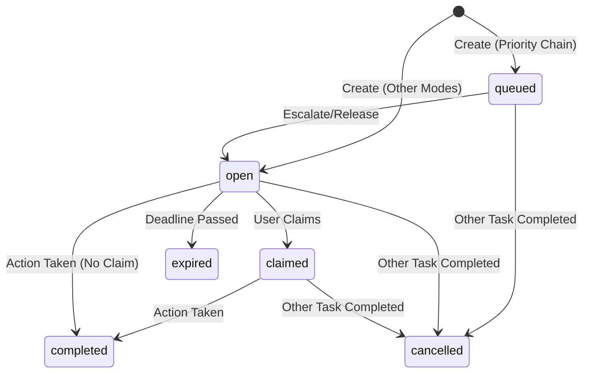

## Overview

Human tasks represent actionable work items that pause workflow execution and wait for a user to approve, reject, revert, or perform a custom action. They are the core mechanism for human-in-the-loop workflows.

When a workflow enters a `human_task` step:
1. The workflow status changes to `waiting`
2. Tasks are created based on assignment rules
3. Assignees are notified via configured channels
4. The workflow pauses until an action is taken

<Info>
  Tasks are resolved from **static association rules** at runtime and stored as actionable rows in the `human_task` table.
</Info>

## Task Creation Flow

From `runtime.py:355-526`, when a human_task step is entered:

```python
def _create_human_tasks(cursor, workflow_instance, step_instance, step_definition):
    # 1. Load assignment policy
    cursor.execute(
        """
        SELECT *
        FROM workflow_step_assignment_policy
        WHERE step_definition_id = %s
        """,
        (step_definition["id"],),
    )
    policy = cursor.fetchone()

    # 2. Load associations
    cursor.execute(
        """
        SELECT *
        FROM workflow_step_association
        WHERE step_definition_id = %s AND is_active = true
        ORDER BY notification_order NULLS LAST, priority NULLS LAST, created_at
        """,
        (step_definition["id"],),
    )
    associations = cursor.fetchall()

    # 3. Resolve to actual users/roles/groups
    resolved_assignees = _resolve_task_assignees(cursor, associations)
    
    # 4. Determine available actions
    available_actions = _available_actions(
        cursor,
        workflow_instance["workflow_version_id"],
        step_definition["id"],
        step_definition["allow_revert"],
    )

    # 5. Create tasks and send notifications
    for index, assignee in enumerate(resolved_assignees):
        # Create task row
        # Send notification if task is open
        # Update workflow status to waiting
```

## Human Task Schema

### human_task

The operational inbox table for actionable work:

| Column | Type | Description |
|--------|------|-------------|
| `id` | uuid | Task ID |
| `workflow_instance_id` | uuid | Parent workflow instance |
| `step_instance_id` | uuid | Step instance this task belongs to |
| `step_definition_id` | uuid | Step definition reference |
| `assigned_user_id` | uuid | Direct user assignment (if applicable) |
| `assigned_role_key` | text | Role assignment (e.g., "manager") |
| `assigned_group_key` | text | Group assignment (e.g., "finance_team") |
| `approval_mode_snapshot` | text | Copy of approval mode from policy |
| `priority_rank` | int | Resolved priority for this task |
| `sequence_no` | int | Notification/escalation order |
| `status` | text | `queued`, `open`, `claimed`, `completed`, `expired`, `cancelled` |
| `available_actions` | jsonb | Array of allowed actions: `["approve", "reject", "revert"]` |
| `due_at` | timestamptz | Task due date (for reminders) |
| `escalation_due_at` | timestamptz | When to escalate to next assignee |
| `claimed_at` | timestamptz | When user claimed the task |
| `completed_at` | timestamptz | When action was taken |
| `created_at` | timestamptz | Task creation timestamp |

**Key Indexes:**
- `(status, assigned_user_id)` - For user inbox queries
- `(status, assigned_role_key)` - For role-based queries
- `(step_instance_id)` - For step-level queries

## Task States



### Status Values

| Status | Description |
|--------|-------------|
| `queued` | Task created but not yet available (priority_chain escalation) |
| `open` | Task available for action |
| `claimed` | User has claimed the task (optional state) |
| `completed` | Task action was taken successfully |
| `expired` | Task deadline passed without action |
| `cancelled` | Task cancelled (e.g., another user completed in approve_any_one mode) |

### Task Status Logic

From `runtime.py:396-409`:

```python
for index, assignee in enumerate(resolved_assignees):
    task_status = (
        "open"
        if approval_mode in {"approve_any_one", "approve_all", "notify_all"} or index == 0
        else "queued"
    )
    escalation_due_at = None
    if task_status == "queued":
        timeout_seconds = (
            assignee["escalation_after_seconds"]
            or (policy["escalation_timeout_seconds"] if policy else None)
            or 86400
        )
        escalation_due_at = now + timedelta(seconds=timeout_seconds * index)
```

<Note>
  In `priority_chain` mode, only the first task starts as `open`. Others are `queued` with escalation timestamps.
</Note>

## Assignment Resolution

### Association Types

Static association rules define who can act on a step:

```python
# From workflow_schemas.py:10-11
AssociationType = Literal["user", "role", "group", "sql_rule"]
```

#### User Assignment

Direct user assignment by email or user ID:

```json
{
  "associationType": "user",
  "associationValue": "manager@example.com",
  "canApprove": true,
  "canReject": true,
  "canRevert": false,
  "priority": 1,
  "escalationAfterSeconds": 86400
}
```

#### Role Assignment

Assign to all users with a specific role:

```json
{
  "associationType": "role",
  "associationValue": "finance_manager",
  "priority": 1
}
```

#### Group Assignment

Assign to a team or organizational group:

```json
{
  "associationType": "group",
  "associationValue": "approval_team",
  "priority": 1
}
```

### Resolution Logic

From `runtime.py:296-352`:

```python
def _resolve_task_assignees(cursor, associations):
    resolved = []
    for association in associations:
        if association["association_type"] == "user":
            value = association["association_value"]
            if "@" in value:
                # Look up user by email
                cursor.execute(
                    'SELECT id, email FROM "user" WHERE email = %s',
                    (value,),
                )
                user_row = cursor.fetchone()
                if user_row is None:
                    continue
                resolved.append(
                    {
                        "assigned_user_id": user_row["id"],
                        "assigned_role_key": None,
                        "assigned_group_key": None,
                        "priority": association["priority"],
                        "notification_order": association["notification_order"],
                        "escalation_after_seconds": association["escalation_after_seconds"],
                    }
                )
            else:
                # Direct user ID
                resolved.append(
                    {
                        "assigned_user_id": value,
                        "assigned_role_key": None,
                        "assigned_group_key": None,
                        # ... priority, etc.
                    }
                )
        elif association["association_type"] == "role":
            resolved.append(
                {
                    "assigned_user_id": None,
                    "assigned_role_key": association["association_value"],
                    # ...
                }
            )
        # ... similar for group
    return resolved
```

## Available Actions

The actions available on a task are determined by:
1. The step's outgoing transitions
2. The step's `allowRevert` flag
3. The association's permission flags (`canApprove`, `canReject`, `canRevert`)

From `runtime.py:280-293`:

```python
def _available_actions(cursor, workflow_version_id, from_step_definition_id, allow_revert: bool):
    cursor.execute(
        """
        SELECT DISTINCT action_type
        FROM workflow_transition_definition
        WHERE workflow_version_id = %s AND from_step_definition_id = %s
        ORDER BY action_type
        """,
        (workflow_version_id, from_step_definition_id),
    )
    actions = [row["action_type"] for row in cursor.fetchall()]
    if not allow_revert:
        actions = [action for action in actions if action != "revert"]
    return actions
```

Stored in task:

```json
{
  "availableActions": ["approve", "reject", "revert"]
}
```

## Task Actions

### Taking Action

```bash
POST /api/v1/human-tasks/{task_id}/actions
```

```json
{
  "actionType": "approve",
  "remark": "Invoice verified and approved",
  "payload": {
    "approvalCode": "APR-2026-001"
  }
}
```

Convenience endpoints also exist:
- `POST /api/v1/human-tasks/{task_id}/approve`
- `POST /api/v1/human-tasks/{task_id}/reject`
- `POST /api/v1/human-tasks/{task_id}/revert`

### Action Validation

From `runtime.py:1241-1277`:

```python
def _apply_task_action(
    cursor,
    task_row,
    user: AuthenticatedUser,
    payload: WorkflowTaskActionRequest,
) -> WorkflowTaskActionResponse:
    # 1. Check task is open
    if task_row["status"] != "open":
        raise HTTPException(
            status_code=status.HTTP_409_CONFLICT,
            detail="Only open tasks can be actioned.",
        )

    # 2. Check user is assigned
    if not _current_user_matches_task(user, task_row):
        raise HTTPException(
            status_code=status.HTTP_403_FORBIDDEN,
            detail="You are not assigned to this task.",
        )

    # 3. Check remark requirement
    if _remark_required(task_row, payload.actionType) and not payload.remark:
        raise HTTPException(
            status_code=status.HTTP_422_UNPROCESSABLE_ENTITY,
            detail="A remark is required for this action.",
        )

    # 4. Validate transition exists
    transition = _transition_for_action(
        cursor,
        task_row["workflow_version_id"],
        task_row["step_definition_id"],
        action_type,
        payload.actionCode,
    )
    if transition is None and action_type != "approve":
        raise HTTPException(
            status_code=status.HTTP_422_UNPROCESSABLE_ENTITY,
            detail="No matching transition exists for this action.",
        )
```

### Remark Requirements

Steps can require remarks (comments) for specific actions:

```json
{
  "stepCode": "manager_review",
  "remarkRequiredOnApprove": false,
  "remarkRequiredOnReject": true,
  "remarkRequiredOnRevert": true
}
```

From `runtime.py:1231-1238`:

```python
def _remark_required(task_row, action_type: str) -> bool:
    if action_type == "approve":
        return task_row["remark_required_on_approve"]
    if action_type == "reject":
        return task_row["remark_required_on_reject"]
    if action_type == "revert":
        return task_row["remark_required_on_revert"]
    return False
```

### Cancelling Other Tasks

In `approve_any_one` mode, when one user completes a task, all other tasks for that step are cancelled:

```python
# From runtime.py:574-582
def _cancel_other_tasks(cursor, step_instance_id, except_task_id):
    cursor.execute(
        """
        UPDATE human_task
        SET status = 'cancelled'
        WHERE step_instance_id = %s AND id <> %s AND status IN ('queued', 'open', 'claimed')
        """,
        (step_instance_id, except_task_id),
    )
```

From `runtime.py:1346`:

```python
_cancel_other_tasks(cursor, task_row["step_instance_id"], task_row["id"])
```

## Notifications

### Notification Creation

When tasks become `open`, notifications are sent:

```python
# From runtime.py:455-497
if task_status == "open" and task_row["assigned_user_id"]:
    active_user_ids.append(task_row["assigned_user_id"])
    cursor.execute(
        'SELECT email FROM "user" WHERE id = %s',
        (task_row["assigned_user_id"],),
    )
    assignee_row = cursor.fetchone()
    notification_title, notification_body = _render_notification_template(
        notification_template["title_template"] if notification_template else None,
        notification_template["body_template"] if notification_template else None,
        {
            "workflowName": workflow_instance["workflow_definition_name"],
            "stepLabel": step_definition["step_label"],
            "stepCode": step_definition["step_code"],
            "actorEmail": assignee_row["email"] if assignee_row else "",
        },
        fallback_title=f"Action required: {step_definition['step_label']}",
        fallback_body=(
            f"The workflow '{workflow_instance['workflow_definition_name']}' is waiting "
            "for your action."
        ),
    )
    _create_notification(
        cursor,
        task_row["assigned_user_id"],
        workflow_instance["id"],
        step_instance["id"],
        "task_assigned",
        notification_title,
        notification_body,
    )
```

### Notification Templates

Templates can be configured per step:

```json
{
  "stepCode": "manager_review",
  "notificationTemplate": {
    "titleTemplate": "Invoice Approval Required: {workflowName}",
    "bodyTemplate": "Please review invoice at step {stepLabel}. Assigned to {actorEmail}.",
    "allowActorOverride": true
  }
}
```

### Template Rendering

From `runtime.py:122-136`:

```python
def _render_notification_template(
    title_template: str | None,
    body_template: str | None,
    context: dict[str, Any],
    fallback_title: str,
    fallback_body: str,
) -> tuple[str, str]:
    title = title_template or fallback_title
    body = body_template or fallback_body

    for key, value in context.items():
        title = title.replace(f"{{{key}}}", str(value))
        body = body.replace(f"{{{key}}}", str(value))

    return title, body
```

**Supported Variables:**
- `{workflowName}` - Workflow definition name
- `{stepLabel}` - Step display label
- `{stepCode}` - Step code
- `{actorEmail}` - Assignee email

## Escalation

Tasks can escalate to the next assignee after a timeout.

### Configuration

Set at the association level:

```json
{
  "associations": [
    {
      "associationType": "user",
      "associationValue": "manager@example.com",
      "priority": 1,
      "notificationOrder": 1,
      "escalationAfterSeconds": 86400
    },
    {
      "associationType": "user",
      "associationValue": "director@example.com",
      "priority": 2,
      "notificationOrder": 2,
      "escalationAfterSeconds": 172800
    }
  ]
}
```

Or at the policy level:

```json
{
  "assignmentPolicy": {
    "approvalMode": "priority_chain",
    "priorityEscalationEnabled": true,
    "escalationTimeoutSeconds": 86400,
    "maxEscalationCount": 3
  }
}
```

### Escalation Due Dates

From `runtime.py:402-409`:

```python
if task_status == "queued":
    timeout_seconds = (
        assignee["escalation_after_seconds"]
        or (policy["escalation_timeout_seconds"] if policy else None)
        or 86400
    )
    escalation_due_at = now + timedelta(seconds=timeout_seconds * index)
```

Tasks store `escalation_due_at` which background workers can query to release queued tasks.

<Warning>
  Escalation processing requires a background worker that monitors `escalation_due_at` and changes task status from `queued` to `open`.
</Warning>

## My Tasks API

Users can query their assigned tasks:

```bash
GET /api/v1/me/tasks
```

From `runtime.py:1470-1517`:

```python
@router.get("/api/v1/me/tasks", response_model=HumanTaskListResponse)
def list_my_tasks(user: AuthenticatedUser = Depends(get_current_user)) -> HumanTaskListResponse:
    with get_db_connection() as connection:
        with connection.cursor() as cursor:
            cursor.execute(
                """
                SELECT
                    ht.*,
                    sd.step_code,
                    sd.step_label
                FROM human_task ht
                JOIN workflow_step_definition sd ON sd.id = ht.step_definition_id
                LEFT JOIN "user" assigned ON assigned.id = ht.assigned_user_id
                WHERE (
                    ht.assigned_user_id = %s
                    OR assigned.email = %s
                    OR ht.assigned_role_key = 'user'
                )
                ORDER BY ht.created_at DESC
                """,
                (user.user_id, user.email),
            )
            rows = cursor.fetchall()

    return HumanTaskListResponse(
        items=[
            HumanTaskResponse(
                id=row["id"],
                workflowInstanceId=row["workflow_instance_id"],
                stepInstanceId=row["step_instance_id"],
                stepCode=row["step_code"],
                stepLabel=row["step_label"],
                status=row["status"],
                availableActions=row["available_actions"] or [],
                # ... other fields
            )
            for row in rows
        ]
    )
```

## Example: Complete Task Flow

<Steps>
  <Step title="Workflow Enters Human Task Step">
    ```python
    # runtime.py:871-876
    if step_definition["step_type"] == "human_task":
        _create_human_tasks(cursor, workflow_instance, step_instance, step_definition)
    ```
  </Step>
  
  <Step title="Tasks Created Based on Associations">
    ```sql
    INSERT INTO human_task (
        workflow_instance_id,
        step_instance_id,
        assigned_user_id,
        status,
        available_actions
    )
    VALUES (...)
    ```
  </Step>
  
  <Step title="Notifications Sent to Open Tasks">
    ```python
    _create_notification(
        cursor,
        user_id,
        workflow_instance["id"],
        step_instance["id"],
        "task_assigned",
        title,
        body,
    )
    ```
  </Step>
  
  <Step title="Workflow Status Changes to Waiting">
    ```python
    cursor.execute(
        """
        UPDATE workflow_instance
        SET status = 'waiting'
        WHERE id = %s
        """,
        (workflow_instance["id"],),
    )
    ```
  </Step>
  
  <Step title="User Takes Action">
    ```bash
    POST /api/v1/human-tasks/{task_id}/approve
    ```
  </Step>
  
  <Step title="Task Completed, Other Tasks Cancelled">
    ```python
    cursor.execute(
        "UPDATE human_task SET status = 'completed' WHERE id = %s",
        (task_id,),
    )
    _cancel_other_tasks(cursor, step_instance_id, task_id)
    ```
  </Step>
  
  <Step title="Workflow Advances to Next Step">
    ```python
    transition = _transition_for_action(...)
    next_step = _get_step_by_id(cursor, transition["to_step_definition_id"])
    _enter_step(cursor, workflow_instance, next_step, "approve")
    ```
  </Step>
</Steps>

## Best Practices

<CardGroup cols={2}>
  <Card title="Clear Task Labels" icon="tag">
    Use descriptive step labels so users understand what action is required
  </Card>
  
  <Card title="Require Remarks" icon="comment">
    Enable remark requirements for reject/revert to capture rationale
  </Card>
  
  <Card title="Set Escalation Timeouts" icon="clock">
    Configure realistic escalation windows based on business SLAs
  </Card>
  
  <Card title="Custom Notifications" icon="bell">
    Provide context-rich notification templates for better user experience
  </Card>
</CardGroup>

## Related Concepts

<CardGroup cols={2}>
  <Card title="Approval Modes" icon="users" href="/concepts/approval-modes">
    Learn about priority_chain, approve_any_one, approve_all
  </Card>
  
  <Card title="Steps and Transitions" icon="route" href="/concepts/steps-and-transitions">
    Understand step types and transition actions
  </Card>
  
  <Card title="Workflow Instances" icon="play" href="/concepts/workflow-instances">
    Learn about runtime execution
  </Card>
</CardGroup>