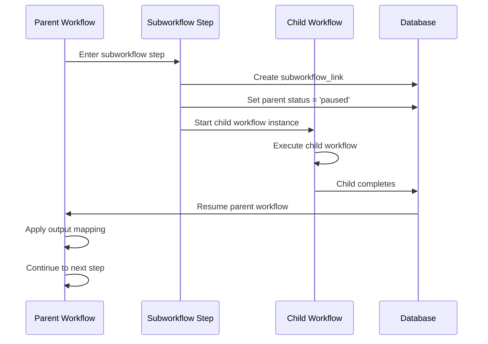

## Overview

Subworkflows allow a workflow step to **trigger another workflow as a child process**. The parent workflow pauses and waits for the child to complete before resuming. This enables:

- Workflow composition and reuse
- Delegation of complex sub-processes
- Isolation of concerns (e.g., vendor verification as a separate workflow)
- Data exchange between parent and child

<Info>
  Parent workflows enter `paused` status while waiting. Child workflows run independently with their own instance ID and can be monitored separately.
</Info>

## How Subworkflows Work

### High-Level Flow



### Key Principles

1. **Parent pauses** when child starts
2. **Child runs independently** with its own workflow instance
3. **Parent resumes automatically** when child reaches terminal state
4. **Data flows** via input/output mappings
5. **Completion action** determines how parent advances

## Subworkflow Step Type

Steps of type `subworkflow` trigger child workflows:

```json
{
  "stepCode": "vendor_verification",
  "stepLabel": "Verify Vendor",
  "stepType": "subworkflow",
  "subworkflowMapping": {
    "childWorkflowDefinitionId": "uuid-of-vendor-workflow",
    "childWorkflowVersionId": null,
    "triggerMode": "sync_wait",
    "inputMapping": {
      "vendorId": "$.vendor.id",
      "requestDate": "$.submittedAt"
    },
    "outputMapping": {
      "vendorVerified": "$.result.verified",
      "verificationNotes": "$.result.notes"
    },
    "completionAction": "approve",
    "failureAction": "reject"
  }
}
```

## Subworkflow Mapping Schema

### workflow_step_mapping

| Column | Type | Description |
|--------|------|-------------|
| `id` | uuid | Mapping ID |
| `step_definition_id` | uuid (unique) | Parent step (must be `subworkflow` type) |
| `child_workflow_definition_id` | uuid | Target child workflow family |
| `child_workflow_version_id` | uuid (nullable) | Pin to specific version, or null for latest published |
| `trigger_mode` | text | `sync_wait`, `async_wait` |
| `input_mapping` | jsonb | Parent context → child input |
| `output_mapping` | jsonb | Child output → parent context |
| `completion_action` | text | Action when child completes (e.g., `approve`) |
| `failure_action` | text | Action when child fails (e.g., `reject`) |
| `created_at` | timestamptz | Creation timestamp |

From the plan document (line 297-320):

> This supports your requirement that a step can trigger another workflow.
>
> Default behavior:
> - parent step enters `waiting_subworkflow`,
> - child instance starts immediately,
> - parent resumes only after child reaches a terminal state,
> - child output is copied back into parent variables.

## Trigger Modes

From `workflow_schemas.py:13`:

```python
TriggerMode = Literal["sync_wait", "async_wait"]
```

### sync_wait

Parent pauses and waits for child completion before continuing.

**Use case:** Child result is required before parent can proceed (e.g., credit check before loan approval).

### async_wait

Parent waits for child but child executes asynchronously (future enhancement).

<Note>
  Currently, both modes behave as synchronous wait. Async execution without blocking is planned for future releases.
</Note>

## Input Mapping

Maps parent workflow context to child workflow input.

### Mapping Syntax

JSON path expressions reference parent context:

```json
{
  "inputMapping": {
    "vendorId": "$.vendor.id",
    "amount": "$.invoice.total",
    "requestedBy": "$.submitter.email",
    "staticValue": "VENDOR_CHECK"
  }
}
```

- **$.path.to.value** - JSONPath-style reference to parent context
- **Static values** - Literal values are copied as-is

### Resolution Logic

From `runtime.py:595-605`:

```python
def _resolve_mapping_value(path: str, source: dict[str, Any]):
    if path.startswith("$."):
        path = path[2:]
    current: Any = source
    for part in path.split("."):
        if not part:
            continue
        if not isinstance(current, dict):
            return None
        current = current.get(part)
    return current
```

### Input Application

From `runtime.py:662-684`:

```python
# Load parent context
cursor.execute(
    """
    SELECT context_data
    FROM workflow_instance_data
    WHERE workflow_instance_id = %s
    """,
    (parent_workflow_instance["id"],),
)
parent_data = cursor.fetchone()
parent_context = parent_data["context_data"] if parent_data else {}

# Apply input mapping
child_input = {}
for destination, source_path in (mapping["input_mapping"] or {}).items():
    if isinstance(source_path, str):
        child_input[destination] = _resolve_mapping_value(source_path, parent_context or {})
    else:
        child_input[destination] = source_path

# Store in child instance
cursor.execute(
    """
    INSERT INTO workflow_instance_data (
        workflow_instance_id,
        input_data,
        context_data,
        output_data
    )
    VALUES (%s, %s, %s, '{}'::jsonb)
    """,
    (
        child_workflow_instance["id"],
        Json(child_input),
        Json(child_input),
    ),
)
```

## Output Mapping

Maps child workflow output back to parent context.

### Mapping Syntax

```json
{
  "outputMapping": {
    "vendorVerified": "$.result.verified",
    "vendorScore": "$.result.score",
    "verificationTimestamp": "$.completedAt"
  }
}
```

**Destination keys** are added/updated in parent context.

### Output Application Logic

From `runtime.py:608-617`:

```python
def _apply_output_mapping(output_mapping: dict[str, Any], payload: dict[str, Any], current_context: dict[str, Any]):
    updated = dict(current_context)
    for destination, source_path in (output_mapping or {}).items():
        value = (
            _resolve_mapping_value(source_path, payload)
            if isinstance(source_path, str)
            else source_path
        )
        updated[destination] = value
    return updated
```

From `runtime.py:765-787`:

```python
# Resume parent from child completion
cursor.execute(
    """
    SELECT context_data
    FROM workflow_instance_data
    WHERE workflow_instance_id = %s
    """,
    (parent_workflow_instance["id"],),
)
parent_data = cursor.fetchone()
parent_context = parent_data["context_data"] if parent_data else {}

# Apply output mapping
updated_context = _apply_output_mapping(
    mapping["output_mapping"] or {},
    output_payload,
    parent_context or {},
)

# Update parent context
cursor.execute(
    """
    UPDATE workflow_instance_data
    SET context_data = %s, updated_at = now()
    WHERE workflow_instance_id = %s
    """,
    (Json(updated_context), parent_workflow_instance["id"]),
)
```

## Starting Child Workflows

When parent enters a subworkflow step:

### Step Entry Logic

From `runtime.py:878-913`:

```python
if step_definition["step_type"] == "subworkflow":
    mapping = _get_mapping(cursor, step_definition["id"])
    if mapping is None:
        raise HTTPException(
            status_code=status.HTTP_422_UNPROCESSABLE_ENTITY,
            detail=f"Subworkflow step '{step_definition['step_code']}' has no mapping.",
        )

    # Pause parent
    cursor.execute(
        """
        UPDATE workflow_instance
        SET status = 'paused', current_step_instance_id = %s, updated_at = now()
        WHERE id = %s
        """,
        (step_instance["id"], workflow_instance["id"]),
    )
    _record_status_history(
        cursor,
        workflow_instance["id"],
        workflow_instance["status"],
        "paused",
        reason="waiting on subworkflow",
    )
    
    # Set step to waiting
    cursor.execute(
        """
        UPDATE step_instance
        SET status = 'waiting', waiting_since = now()
        WHERE id = %s
        """,
        (step_instance["id"],),
    )
    
    # Start child
    _start_child_workflow_instance(cursor, workflow_instance, step_instance, mapping)
```

### Child Instance Creation

From `runtime.py:620-704`:

<Accordion title="View Complete Child Creation Logic">
```python
def _start_child_workflow_instance(cursor, parent_workflow_instance, parent_step_instance, mapping):
    # Resolve child workflow version
    child_version = _resolve_version(
        cursor,
        workflow_definition_id=mapping["child_workflow_definition_id"],
    )
    
    # Generate business key
    business_key = (
        f"{parent_workflow_instance['id']}::{parent_step_instance['id']}::child"
    )
    
    # Create child instance
    cursor.execute(
        """
        INSERT INTO workflow_instance (
            workflow_version_id,
            business_key,
            run_number,
            status,
            started_by,
            parent_workflow_instance_id,
            parent_step_instance_id
        )
        VALUES (%s, %s, 1, 'running', %s, %s, %s)
        RETURNING *
        """,
        (
            child_version["id"],
            business_key,
            parent_workflow_instance.get("started_by"),
            parent_workflow_instance["id"],
            parent_step_instance["id"],
        ),
    )
    child_workflow_instance = cursor.fetchone()
    child_workflow_instance["workflow_definition_name"] = child_version["name"]

    # Load parent context
    cursor.execute(
        """
        SELECT context_data
        FROM workflow_instance_data
        WHERE workflow_instance_id = %s
        """,
        (parent_workflow_instance["id"],),
    )
    parent_data = cursor.fetchone()
    parent_context = parent_data["context_data"] if parent_data else {}
    
    # Apply input mapping
    child_input = {}
    for destination, source_path in (mapping["input_mapping"] or {}).items():
        if isinstance(source_path, str):
            child_input[destination] = _resolve_mapping_value(source_path, parent_context or {})
        else:
            child_input[destination] = source_path

    # Store child data
    cursor.execute(
        """
        INSERT INTO workflow_instance_data (
            workflow_instance_id,
            input_data,
            context_data,
            output_data
        )
        VALUES (%s, %s, %s, '{}'::jsonb)
        """,
        (
            child_workflow_instance["id"],
            Json(child_input),
            Json(child_input),
        ),
    )
    
    # Create subworkflow link
    cursor.execute(
        """
        INSERT INTO subworkflow_link (
            parent_workflow_instance_id,
            parent_step_instance_id,
            child_workflow_instance_id,
            link_status
        )
        VALUES (%s, %s, %s, 'running')
        """,
        (
            parent_workflow_instance["id"],
            parent_step_instance["id"],
            child_workflow_instance["id"],
        ),
    )

    # Enter child start step
    start_step = _get_start_step(cursor, child_version["id"])
    _enter_step(cursor, child_workflow_instance, start_step, "approve")
```
</Accordion>

## Subworkflow Links

### subworkflow_link

Tracks parent-child relationships:

| Column | Type | Description |
|--------|------|-------------|
| `id` | uuid | Link ID |
| `parent_workflow_instance_id` | uuid | Parent workflow instance |
| `parent_step_instance_id` | uuid | Parent step that spawned child |
| `child_workflow_instance_id` | uuid | Child workflow instance |
| `link_status` | text | `running`, `completed`, `failed`, `cancelled` |
| `resume_action` | text | Action to apply to parent on completion |
| `linked_at` | timestamptz | When child was started |
| `completed_at` | timestamptz | When child completed |

From the plan document (lines 469-483):

> Explicit parent-child linkage for resumptions and traceability.

## Resuming Parent Workflows

When a child workflow completes, the parent automatically resumes.

### Completion Detection

From `runtime.py:567-572`:

```python
if workflow_instance.get("parent_workflow_instance_id") and workflow_instance.get(
    "parent_step_instance_id"
):
    _resume_parent_from_child(cursor, workflow_instance, result_action)
```

Triggered when child workflow calls `_complete_workflow`.

### Resume Logic

From `runtime.py:707-834`:

<Accordion title="View Complete Resume Logic">
```python
def _resume_parent_from_child(cursor, child_workflow_instance, child_result_action: str):
    # Load child output
    cursor.execute(
        """
        SELECT output_data, context_data
        FROM workflow_instance_data
        WHERE workflow_instance_id = %s
        """,
        (child_workflow_instance["id"],),
    )
    child_data = cursor.fetchone()
    output_payload = (
        (child_data["output_data"] if child_data and child_data["output_data"] else None)
        or (child_data["context_data"] if child_data and child_data["context_data"] else None)
        or {}
    )

    # Load parent step instance
    cursor.execute(
        """
        SELECT *
        FROM step_instance
        WHERE id = %s
        """,
        (child_workflow_instance["parent_step_instance_id"],),
    )
    parent_step_instance = cursor.fetchone()
    if parent_step_instance is None:
        return

    # Load parent workflow instance
    cursor.execute(
        """
        SELECT *
        FROM workflow_instance
        WHERE id = %s
        """,
        (child_workflow_instance["parent_workflow_instance_id"],),
    )
    parent_workflow_instance = cursor.fetchone()
    if parent_workflow_instance is None:
        return

    # Load mapping
    parent_step_definition = _get_step_by_id(cursor, parent_step_instance["step_definition_id"])
    mapping = _get_mapping(cursor, parent_step_definition["id"])
    if mapping is None:
        return

    # Update link
    cursor.execute(
        """
        UPDATE subworkflow_link
        SET link_status = %s, resume_action = %s, completed_at = now()
        WHERE child_workflow_instance_id = %s
        """,
        (
            "completed" if child_result_action == "approve" else "failed",
            mapping["completion_action"] if child_result_action == "approve" else mapping["failure_action"],
            child_workflow_instance["id"],
        ),
    )

    # Apply output mapping
    cursor.execute(
        """
        SELECT context_data
        FROM workflow_instance_data
        WHERE workflow_instance_id = %s
        """,
        (parent_workflow_instance["id"],),
    )
    parent_data = cursor.fetchone()
    parent_context = parent_data["context_data"] if parent_data else {}
    updated_context = _apply_output_mapping(
        mapping["output_mapping"] or {},
        output_payload,
        parent_context or {},
    )
    cursor.execute(
        """
        UPDATE workflow_instance_data
        SET context_data = %s, updated_at = now()
        WHERE workflow_instance_id = %s
        """,
        (Json(updated_context), parent_workflow_instance["id"]),
    )

    # Complete parent step
    cursor.execute(
        """
        UPDATE step_instance
        SET status = %s, completed_at = now(), result_action = %s, result_payload = %s
        WHERE id = %s
        """,
        (
            "completed" if child_result_action == "approve" else "failed",
            mapping["completion_action"] if child_result_action == "approve" else mapping["failure_action"],
            Json(output_payload),
            parent_step_instance["id"],
        ),
    )

    # Determine action to apply
    action_to_apply = (
        mapping["completion_action"] if child_result_action == "approve" else mapping["failure_action"]
    )
    
    # Find transition
    transition = _transition_for_action(
        cursor,
        parent_workflow_instance["workflow_version_id"],
        parent_step_definition["id"],
        action_to_apply,
        None,
    )
    
    # Check if terminal
    if transition is None or transition["to_step_definition_id"] is None:
        _complete_workflow(cursor, parent_workflow_instance, parent_step_instance, action_to_apply)
        return

    # Resume parent
    cursor.execute(
        """
        UPDATE workflow_instance
        SET status = 'running', updated_at = now()
        WHERE id = %s
        """,
        (parent_workflow_instance["id"],),
    )
    _record_status_history(
        cursor,
        parent_workflow_instance["id"],
        "paused",
        "running",
        reason="subworkflow completed",
    )

    # Advance to next step
    next_step = _get_step_by_id(cursor, transition["to_step_definition_id"])
    _enter_step(cursor, parent_workflow_instance, next_step, action_to_apply)
```
</Accordion>

## Completion and Failure Actions

### Completion Action

Applied to parent when child completes successfully:

```json
{
  "completionAction": "approve"
}
```

Typically `approve` to continue forward.

### Failure Action

Applied to parent when child fails or is rejected:

```json
{
  "failureAction": "reject"
}
```

Typically `reject` to route to failure path, or `revert` to retry.

### Action Application

From `runtime.py:803-814`:

```python
action_to_apply = (
    mapping["completion_action"] if child_result_action == "approve" else mapping["failure_action"]
)
transition = _transition_for_action(
    cursor,
    parent_workflow_instance["workflow_version_id"],
    parent_step_definition["id"],
    action_to_apply,
    None,
)
if transition is None or transition["to_step_definition_id"] is None:
    _complete_workflow(cursor, parent_workflow_instance, parent_step_instance, action_to_apply)
    return
```

## Example: Invoice with Vendor Verification

### Parent Workflow: Invoice Approval

```json
{
  "key": "invoice_approval",
  "steps": [
    {
      "stepCode": "start",
      "stepType": "start"
    },
    {
      "stepCode": "verify_vendor",
      "stepLabel": "Verify Vendor",
      "stepType": "subworkflow",
      "subworkflowMapping": {
        "childWorkflowDefinitionId": "vendor-verification-uuid",
        "triggerMode": "sync_wait",
        "inputMapping": {
          "vendorId": "$.invoice.vendorId",
          "companyName": "$.invoice.vendorName"
        },
        "outputMapping": {
          "vendorStatus": "$.verification.status",
          "riskScore": "$.verification.riskScore"
        },
        "completionAction": "approve",
        "failureAction": "reject"
      }
    },
    {
      "stepCode": "manager_review",
      "stepLabel": "Manager Review",
      "stepType": "human_task"
    },
    {
      "stepCode": "approved",
      "stepType": "end"
    },
    {
      "stepCode": "rejected",
      "stepType": "end"
    }
  ],
  "transitions": [
    {
      "fromStepCode": "start",
      "toStepCode": "verify_vendor",
      "actionType": "approve"
    },
    {
      "fromStepCode": "verify_vendor",
      "toStepCode": "manager_review",
      "actionType": "approve"
    },
    {
      "fromStepCode": "verify_vendor",
      "toStepCode": "rejected",
      "actionType": "reject"
    },
    {
      "fromStepCode": "manager_review",
      "toStepCode": "approved",
      "actionType": "approve"
    },
    {
      "fromStepCode": "manager_review",
      "toStepCode": "rejected",
      "actionType": "reject"
    }
  ]
}
```

### Child Workflow: Vendor Verification

```json
{
  "key": "vendor_verification",
  "steps": [
    {
      "stepCode": "start",
      "stepType": "start"
    },
    {
      "stepCode": "check_database",
      "stepLabel": "Check Vendor Database",
      "stepType": "system_task"
    },
    {
      "stepCode": "manual_review",
      "stepLabel": "Manual Verification",
      "stepType": "human_task",
      "assignmentPolicy": {
        "approvalMode": "approve_any_one"
      },
      "associations": [
        {
          "associationType": "role",
          "associationValue": "compliance_officer"
        }
      ]
    },
    {
      "stepCode": "verified",
      "stepType": "end"
    },
    {
      "stepCode": "rejected",
      "stepType": "end"
    }
  ],
  "transitions": [
    {
      "fromStepCode": "start",
      "toStepCode": "check_database",
      "actionType": "approve"
    },
    {
      "fromStepCode": "check_database",
      "toStepCode": "verified",
      "actionType": "approve",
      "conditionExpression": "$.vendorFound == true",
      "priority": 1
    },
    {
      "fromStepCode": "check_database",
      "toStepCode": "manual_review",
      "actionType": "approve",
      "priority": 2
    },
    {
      "fromStepCode": "manual_review",
      "toStepCode": "verified",
      "actionType": "approve"
    },
    {
      "fromStepCode": "manual_review",
      "toStepCode": "rejected",
      "actionType": "reject"
    }
  ]
}
```

### Execution Flow

<Steps>
  <Step title="Parent Starts">
    Invoice approval workflow created with:
    ```json
    {
      "inputData": {
        "invoice": {
          "vendorId": "V-12345",
          "vendorName": "Acme Corp",
          "amount": 50000
        }
      }
    }
    ```
  </Step>
  
  <Step title="Parent Enters Subworkflow Step">
    - Parent status → `paused`
    - Subworkflow link created
    - Input mapping applied:
      ```json
      {
        "vendorId": "V-12345",
        "companyName": "Acme Corp"
      }
      ```
  </Step>
  
  <Step title="Child Workflow Starts">
    - Child instance created
    - Child enters `start` step
    - Child advances through verification process
  </Step>
  
  <Step title="Child Completes">
    - Child reaches `verified` end step
    - Output data:
      ```json
      {
        "verification": {
          "status": "approved",
          "riskScore": 15
        }
      }
      ```
  </Step>
  
  <Step title="Parent Resumes">
    - Output mapping applied to parent context:
      ```json
      {
        "vendorStatus": "approved",
        "riskScore": 15
      }
      ```
    - Parent status → `running`
    - Parent advances with `approve` action
  </Step>
  
  <Step title="Parent Continues">
    Parent enters `manager_review` step with enriched context including vendor verification results
  </Step>
</Steps>

## Querying Subworkflow Relationships

### Find Child Workflows

```sql
SELECT 
  wi.id,
  wi.workflow_version_id,
  wi.status,
  swl.link_status,
  swl.resume_action
FROM workflow_instance wi
JOIN subworkflow_link swl ON swl.child_workflow_instance_id = wi.id
WHERE swl.parent_workflow_instance_id = :parent_id
```

### Find Parent Workflow

```sql
SELECT
  parent_wi.id,
  parent_wi.workflow_version_id,
  parent_wi.status
FROM workflow_instance parent_wi
JOIN workflow_instance child_wi ON child_wi.parent_workflow_instance_id = parent_wi.id
WHERE child_wi.id = :child_id
```

## Best Practices

<CardGroup cols={2}>
  <Card title="Design Reusable Children" icon="recycle">
    Create child workflows that can be reused across multiple parent workflows
  </Card>
  
  <Card title="Clear Input/Output Contracts" icon="file-contract">
    Document expected input and output fields for child workflows
  </Card>
  
  <Card title="Handle Both Success and Failure" icon="code-branch">
    Always configure both completionAction and failureAction
  </Card>
  
  <Card title="Test Nested Workflows" icon="layer-group">
    Verify behavior with multiple levels of nesting (child spawning grandchild)
  </Card>
</CardGroup>

## Related Concepts

<CardGroup cols={2}>
  <Card title="Workflow Instances" icon="play" href="/concepts/workflow-instances">
    Learn about parent-child relationships and instance lifecycle
  </Card>
  
  <Card title="Steps and Transitions" icon="route" href="/concepts/steps-and-transitions">
    Understand step types including subworkflow steps
  </Card>
  
  <Card title="Workflow Definitions" icon="diagram-project" href="/concepts/workflow-definitions">
    Learn about defining reusable workflow templates
  </Card>
</CardGroup>