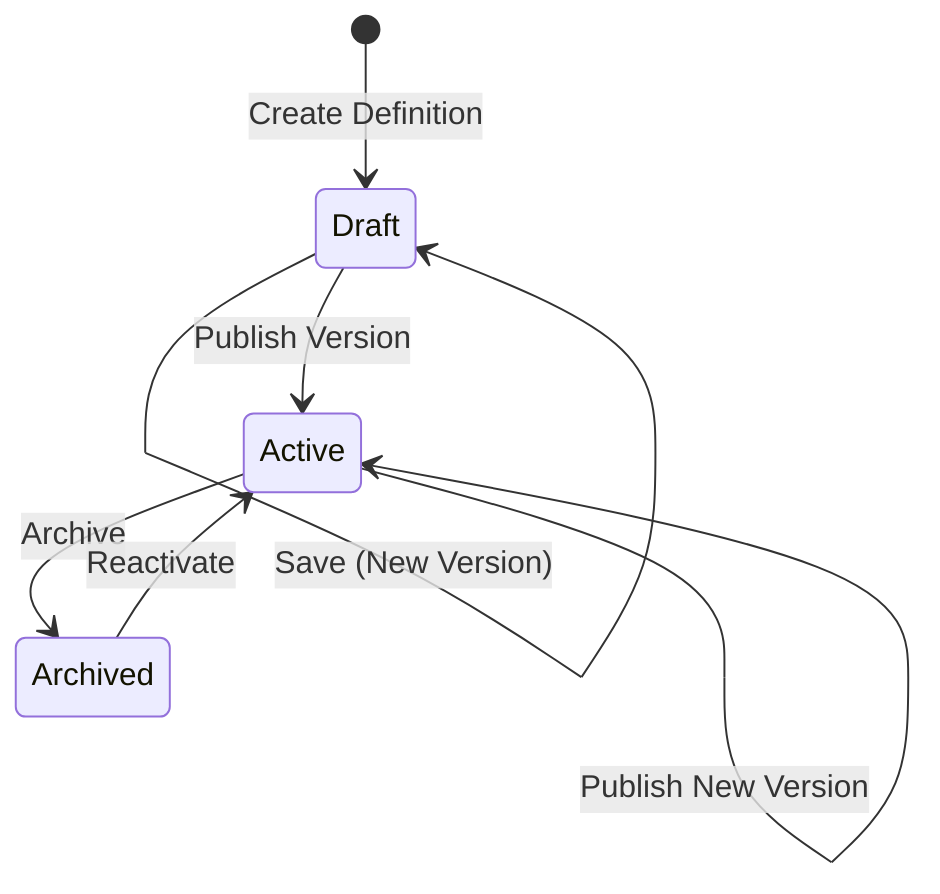

## Overview

Workflow definitions are the **static templates** that describe what a workflow is and how it should execute. They are completely separate from runtime execution data, allowing you to edit and version workflows without affecting in-flight instances.

Every workflow definition contains:
- Step definitions describing each node in the workflow graph
- Transition definitions describing edges and actions between steps
- Assignment policies for human tasks
- Notification templates
- Visual builder layout metadata

<Note>
  Workflow definitions are **immutable** once published. Changes create new versions, and running instances always reference their original definition version.
</Note>

## Core Schema

### workflow_definition

The top-level workflow identity:

| Column | Type | Description |
|--------|------|-------------|
| `id` | uuid | Stable definition ID |
| `key` | text (unique) | Machine-readable key like `invoice_approval` |
| `name` | text | Display name for the UI |
| `description` | text | Business description |
| `status` | text | `draft`, `active`, or `archived` |
| `created_by` | uuid | User who created the definition |
| `created_at` | timestamptz | Creation timestamp |
| `updated_at` | timestamptz | Last update timestamp |

### workflow_definition_version

Immutable versioned snapshots that runtime instances reference:

| Column | Type | Description |
|--------|------|-------------|
| `id` | uuid | Version ID |
| `workflow_definition_id` | uuid | Parent definition reference |
| `version_no` | int | Sequential version number (1, 2, 3...) |
| `is_published` | bool | Only one published version at a time |
| `version_label` | text | Optional semantic label (e.g., "v1", "v2") |
| `definition_snapshot` | jsonb | Complete denormalized definition export |
| `graph_json` | jsonb | Canonical JSON graph from steps + transitions |
| `builder_layout` | jsonb | React Flow viewport, nodes, and edge positions |
| `created_by` | uuid | User who created this version |
| `created_at` | timestamptz | Version creation timestamp |

<Info>
  `graph_json` is the **canonical representation** generated from steps and transitions. `builder_layout` stores UI-specific React Flow data so layout changes don't alter workflow semantics.
</Info>

## Graph JSON Structure

The canonical workflow graph is built from step and transition definitions:

```json
{
  "workflow": {
    "key": "invoice_approval",
    "name": "Invoice Approval Workflow",
    "description": "Multi-stage invoice approval process"
  },
  "steps": [
    {
      "stepCode": "start",
      "stepLabel": "Start",
      "stepType": "start",
      "isTerminal": false
    },
    {
      "stepCode": "manager_review",
      "stepLabel": "Manager Review",
      "stepType": "human_task",
      "remarkRequiredOnReject": true,
      "assignmentPolicy": {
        "approvalMode": "priority_chain",
        "escalationTimeoutSeconds": 86400
      },
      "associations": [
        {
          "associationType": "role",
          "associationValue": "manager",
          "priority": 1
        }
      ]
    },
    {
      "stepCode": "end",
      "stepLabel": "Approved",
      "stepType": "end",
      "isTerminal": true
    }
  ],
  "transitions": [
    {
      "fromStepCode": "start",
      "toStepCode": "manager_review",
      "actionType": "approve",
      "transitionLabel": "Submit for Review"
    },
    {
      "fromStepCode": "manager_review",
      "toStepCode": "end",
      "actionType": "approve",
      "transitionLabel": "Approve"
    }
  ]
}
```

This structure is generated in `workflows.py:60-69`:

```python
def _build_graph_json(payload: WorkflowDefinitionCreate) -> dict:
    return {
        "workflow": {
            "key": payload.key,
            "name": payload.name,
            "description": payload.description,
        },
        "steps": [step.model_dump(mode="json") for step in payload.steps],
        "transitions": [transition.model_dump(mode="json") for transition in payload.transitions],
    }
```

## Versioning and Immutability

### Creating Versions

Every save creates a new version. The version number increments sequentially:

```python
# From workflows.py:454-465
cursor.execute(
    """
    SELECT COALESCE(MAX(version_no), 0) AS max_version_no
    FROM workflow_definition_version
    WHERE workflow_definition_id = %s
    """,
    (definition_id,),
)
next_version_no = cursor.fetchone()["max_version_no"] + 1
```

### Publishing Versions

Only one version can be published at a time. Publishing marks the version as the active template:

```python
# From workflows.py:834-856
cursor.execute(
    """
    UPDATE workflow_definition_version
    SET is_published = false
    WHERE workflow_definition_id = %s
    """,
    (definition_id,),
)
cursor.execute(
    """
    UPDATE workflow_definition_version
    SET is_published = true
    WHERE id = (
        SELECT id
        FROM workflow_definition_version
        WHERE workflow_definition_id = %s
        ORDER BY version_no DESC
        LIMIT 1
    )
    """,
    (definition_id,),
)
```

<Warning>
  Runtime instances **always** reference `workflow_version_id`, not the parent definition. This ensures in-flight workflows are never affected by definition changes.
</Warning>

## Validation Rules

Before a workflow version can be created or published, the engine validates the graph structure to prevent broken or unsafe workflows.

### Required Structural Rules

From `workflows.py:72-192`, the validator enforces:

1. **Exactly one start step** must exist
2. **At least one terminal step** (end or terminal flag) must exist
3. **Step codes must be unique** within a version
4. **All transition targets must exist** as valid step codes
5. **Non-terminal steps must have outgoing transitions**
6. **All steps must be reachable** from the start step

```python
# From workflows.py:79-87
start_steps = [step.stepCode for step in payload.steps if step.stepType == "start"]
if len(start_steps) != 1:
    errors.append("Exactly one start step is required.")

terminal_steps = [
    step.stepCode for step in payload.steps if step.isTerminal or step.stepType == "end"
]
if not terminal_steps:
    errors.append("At least one terminal or end step is required.")
```

### Loop Safety

The validator detects cycles and requires **explicit guards** to prevent infinite loops:

<Accordion title="Cycle Detection Logic">
```python
# From workflows.py:152-183
def dfs(step_code: str) -> None:
    visited.add(step_code)
    active_lookup.add(step_code)
    active_stack.append(step_code)

    for transition in outgoing.get(step_code, []):
        next_step = transition.toStepCode
        if not next_step:
            continue

        if next_step in active_lookup:
            # Cycle detected
            cycle = active_stack[active_stack.index(next_step) :]
            if not any(
                steps_by_code[item].maxVisitsPerInstance is not None for item in cycle
            ):
                errors.append(
                    "Detected a cycle without a maxVisitsPerInstance guard on steps: "
                    + ", ".join(cycle)
                )
            continue

        if next_step not in visited:
            dfs(next_step)

    active_stack.pop()
    active_lookup.remove(step_code)
```
</Accordion>

<Tip>
  Use `maxVisitsPerInstance` on steps that can be revisited to prevent infinite loops. Unconditional self-loops are always rejected.
</Tip>

### Transition Constraints

```python
# From workflows.py:101-120
if transition.actionType == "custom" and not transition.actionCode:
    errors.append(
        f"Transition '{transition.fromStepCode}' -> '{transition.toStepCode}' requires an actionCode."
    )

if (
    transition.toStepCode == transition.fromStepCode
    and transition.conditionExpression is None
):
    errors.append(
        f"Unconditional self-loop detected on step '{transition.fromStepCode}'."
    )

if transition.conditionExpression is None:
    signature = (transition.fromStepCode, transition.actionType)
    if signature in seen_unconditional:
        errors.append(
            "Only one unconditional transition is allowed per source step and action type."
        )
    seen_unconditional.add(signature)
```

**Rules:**
- Custom actions require an `actionCode`
- Unconditional self-loops are forbidden
- Only one unconditional transition per step + action type

## Definition Lifecycle



### Status Values

- **draft**: Initial state, not yet published
- **active**: Published and available for new instances
- **archived**: No longer available for new instances (existing instances continue)

## API Operations

### Create Definition

```bash
POST /api/v1/workflow-definitions
```

Creates a new definition with version 1:

```json
{
  "key": "invoice_approval",
  "name": "Invoice Approval",
  "description": "Multi-level invoice approval workflow",
  "steps": [...],
  "transitions": [...]
}
```

See `workflows.py:745-772`

### Update Definition

```bash
PUT /api/v1/workflow-definitions/{definition_id}
```

Creates a new version and updates metadata. See `workflows.py:775-809`

### Publish Version

```bash
POST /api/v1/workflow-definitions/{definition_id}/publish
```

Marks the latest version as published and sets status to `active`. See `workflows.py:812-866`

### Clone Definition

```bash
POST /api/v1/workflow-definitions/{definition_id}/clone
```

Creates a new definition from an existing one with a new key. See `workflows.py:869-906`

## Related Tables

Workflow definitions link to several supporting tables:

- [workflow_step_definition](/concepts/steps-and-transitions) - Individual step definitions
- [workflow_transition_definition](/concepts/steps-and-transitions) - Transition rules
- [workflow_step_association](/concepts/human-tasks) - Assignee rules
- [workflow_step_assignment_policy](/concepts/approval-modes) - Approval strategies
- [workflow_step_mapping](/concepts/subworkflows) - Child workflow configuration
- [notification_template](/concepts/human-tasks) - Task notification templates

## Best Practices

<CardGroup cols={2}>
  <Card title="Use Semantic Versioning" icon="tag">
    Use meaningful version labels like "v1.0", "v2.0-beta" in production environments
  </Card>
  
  <Card title="Test Before Publishing" icon="flask">
    Always test workflow definitions in draft mode before publishing to production
  </Card>
  
  <Card title="Document Changes" icon="book">
    Use the description field to document what changed between versions
  </Card>
  
  <Card title="Guard Loops" icon="shield">
    Always set maxVisitsPerInstance on steps that can be revisited
  </Card>
</CardGroup>

## Next Steps

<CardGroup cols={2}>
  <Card title="Steps and Transitions" icon="route" href="/concepts/steps-and-transitions">
    Learn about step types and transition actions
  </Card>
  
  <Card title="Workflow Instances" icon="play" href="/concepts/workflow-instances">
    Understand runtime execution and instance lifecycle
  </Card>
</CardGroup>