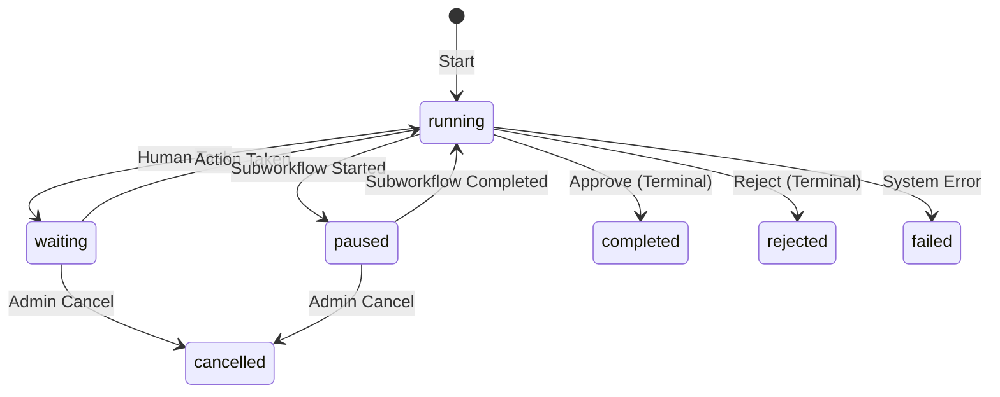

## Overview

A **workflow instance** is a runtime execution of a workflow definition version. While definitions describe what a workflow _is_, instances represent what a workflow _is doing_ right now.

Each instance:
- References an immutable workflow version
- Tracks current execution state and position
- Stores input, context, and output data
- Maintains a complete audit trail of actions
- Can spawn child workflows and be resumed

<Info>
  The database is the **single source of truth** for all workflow state. RabbitMQ is only used for async task delivery.
</Info>

## Core Schema

### workflow_instance

Main runtime row for every started workflow:

| Column | Type | Description |
|--------|------|-------------|
| `id` | uuid | Unique instance ID |
| `workflow_version_id` | uuid | Immutable reference to the definition version |
| `business_key` | text | Optional external correlation ID |
| `run_number` | int | Nth execution for this workflow family/business key |
| `status` | text | Current lifecycle status (see below) |
| `current_step_instance_id` | uuid | Pointer to the active step instance |
| `started_by` | uuid | User who started the workflow |
| `started_at` | timestamptz | Start timestamp |
| `completed_at` | timestamptz | Completion timestamp (null if running) |
| `parent_workflow_instance_id` | uuid | Parent workflow (for subworkflows) |
| `parent_step_instance_id` | uuid | Parent step that spawned this instance |
| `lock_version` | int | Optimistic concurrency control |
| `created_at` | timestamptz | Creation timestamp |
| `updated_at` | timestamptz | Last update timestamp |

**Key Indexes:**
- `(status, updated_at)` - For querying active/waiting workflows
- `(business_key)` - For external correlation
- `(parent_workflow_instance_id)` - For subworkflow queries

### workflow_instance_data

Separate table for runtime variables to avoid bloating the main row:

| Column | Type | Description |
|--------|------|-------------|
| `workflow_instance_id` | uuid (pk) | Reference to workflow instance |
| `input_data` | jsonb | Original request payload (immutable) |
| `context_data` | jsonb | Mutable state bag updated during execution |
| `output_data` | jsonb | Terminal result (populated on completion) |
| `last_error` | jsonb | Error details if workflow failed |
| `updated_at` | timestamptz | Last update timestamp |

## Lifecycle States

Workflow instances progress through these states:



### Status Values

| Status | Description |
|--------|-------------|
| `running` | Workflow is actively executing automatic steps |
| `waiting` | Workflow is paused waiting for human action |
| `paused` | Workflow is waiting for a child workflow to complete |
| `completed` | Workflow reached a terminal step via approve action |
| `rejected` | Workflow reached a terminal step via reject action |
| `failed` | Workflow encountered an unrecoverable error |
| `cancelled` | Workflow was manually cancelled by an admin |

### State Transitions in Code

Status changes are tracked in `workflow_status_history`:

```python
# From runtime.py:57-78
def _record_status_history(
    cursor,
    workflow_instance_id,
    old_status: str | None,
    new_status: str,
    reason: str | None = None,
    changed_by_action_id=None,
) -> None:
    cursor.execute(
        """
        INSERT INTO workflow_status_history (
            workflow_instance_id,
            old_status,
            new_status,
            reason,
            changed_by_action_id
        )
        VALUES (%s, %s, %s, %s, %s)
        """,
        (workflow_instance_id, old_status, new_status, reason, changed_by_action_id),
    )
```

Example from starting a workflow:

```python
# From runtime.py:1152-1159
_record_status_history(
    cursor,
    workflow_instance["id"],
    None,  # old_status (none - workflow just started)
    "running",
    reason="workflow started",
    changed_by_action_id=action_id,
)
```

## Business Keys and Run Numbers

### Business Key

An optional external correlation identifier that allows you to:
- Link workflows to external systems (order ID, ticket number, etc.)
- Query for specific workflow executions
- Track multiple runs of the same business process

```python
# From runtime.py:1083-1091
cursor.execute(
    """
    SELECT COALESCE(MAX(run_number), 0) AS max_run_number
    FROM workflow_instance
    WHERE workflow_version_id = %s AND business_key IS NOT DISTINCT FROM %s
    """,
    (version["id"], payload.businessKey),
)
run_number = cursor.fetchone()["max_run_number"] + 1
```

### Run Number

Automatically increments for each execution of the same workflow family + business key combination:

<CodeGroup>
```json Example: First Run
{
  "workflowKey": "invoice_approval",
  "businessKey": "INV-12345",
  "runNumber": 1
}
```

```json Example: Second Run (Resubmission)
{
  "workflowKey": "invoice_approval",
  "businessKey": "INV-12345",
  "runNumber": 2
}
```
</CodeGroup>

<Tip>
  Use business keys to implement retry logic or track resubmissions of the same business entity.
</Tip>

## Parent-Child Relationships

Workflows can spawn child workflows via [subworkflow steps](/concepts/subworkflows).

### Schema Fields

Child workflows reference their parent:

```sql
parent_workflow_instance_id uuid  -- Parent instance ID
parent_step_instance_id uuid      -- Specific parent step that triggered this child
```

### Creating Child Instances

From `runtime.py:620-704`:

```python
def _start_child_workflow_instance(cursor, parent_workflow_instance, parent_step_instance, mapping):
    child_version = _resolve_version(
        cursor,
        workflow_definition_id=mapping["child_workflow_definition_id"],
    )
    business_key = (
        f"{parent_workflow_instance['id']}::{parent_step_instance['id']}::child"
    )
    cursor.execute(
        """
        INSERT INTO workflow_instance (
            workflow_version_id,
            business_key,
            run_number,
            status,
            started_by,
            parent_workflow_instance_id,
            parent_step_instance_id
        )
        VALUES (%s, %s, 1, 'running', %s, %s, %s)
        RETURNING *
        """,
        (
            child_version["id"],
            business_key,
            parent_workflow_instance.get("started_by"),
            parent_workflow_instance["id"],
            parent_step_instance["id"],
        ),
    )
```

### Subworkflow Linkage

The `subworkflow_link` table tracks parent-child relationships:

| Column | Type | Description |
|--------|------|-------------|
| `id` | uuid | Link ID |
| `parent_workflow_instance_id` | uuid | Parent instance |
| `parent_step_instance_id` | uuid | Parent step |
| `child_workflow_instance_id` | uuid | Child instance |
| `link_status` | text | `running`, `completed`, `failed`, `cancelled` |
| `resume_action` | text | Action applied to parent when child completes |
| `linked_at` | timestamptz | Link creation time |
| `completed_at` | timestamptz | Link completion time |

## Starting Workflow Instances

### API Request

```bash
POST /api/v1/workflow-instances
```

```json
{
  "workflowKey": "invoice_approval",
  "businessKey": "INV-67890",
  "inputData": {
    "invoiceId": "67890",
    "amount": 15000,
    "vendor": "Acme Corp"
  },
  "contextData": {
    "requesterId": "user-123",
    "department": "Engineering"
  }
}
```

### Implementation

From `runtime.py:1060-1165`:

<Accordion title="View Complete Implementation">
```python
@router.post(
    "/api/v1/workflow-instances",
    response_model=WorkflowInstanceResponse,
    status_code=status.HTTP_201_CREATED,
)
def start_workflow_instance(
    payload: WorkflowInstanceStartRequest,
    user: AuthenticatedUser = Depends(get_current_user),
) -> WorkflowInstanceResponse:
    if not payload.workflowDefinitionId and not payload.workflowKey:
        raise HTTPException(
            status_code=status.HTTP_422_UNPROCESSABLE_ENTITY,
            detail="workflowDefinitionId or workflowKey is required.",
        )

    with get_db_connection() as connection:
        with connection.cursor() as cursor:
            # Resolve the published or latest version
            version = _resolve_version(
                cursor,
                workflow_definition_id=payload.workflowDefinitionId,
                workflow_key=payload.workflowKey,
            )

            # Calculate run number
            cursor.execute(
                """
                SELECT COALESCE(MAX(run_number), 0) AS max_run_number
                FROM workflow_instance
                WHERE workflow_version_id = %s AND business_key IS NOT DISTINCT FROM %s
                """,
                (version["id"], payload.businessKey),
            )
            run_number = cursor.fetchone()["max_run_number"] + 1

            # Create instance
            cursor.execute(
                """
                INSERT INTO workflow_instance (
                    workflow_version_id,
                    business_key,
                    run_number,
                    status,
                    started_by
                )
                VALUES (%s, %s, %s, 'running', %s)
                RETURNING *
                """,
                (version["id"], payload.businessKey, run_number, user.user_id),
            )
            workflow_instance = cursor.fetchone()

            # Store data
            cursor.execute(
                """
                INSERT INTO workflow_instance_data (
                    workflow_instance_id,
                    input_data,
                    context_data,
                    output_data
                )
                VALUES (%s, %s, %s, '{}'::jsonb)
                """,
                (
                    workflow_instance["id"],
                    Json(payload.inputData),
                    Json(payload.contextData),
                ),
            )

            # Record action
            cursor.execute(
                """
                INSERT INTO workflow_action (
                    workflow_instance_id,
                    action_type,
                    actor_user_id,
                    actor_type,
                    payload
                )
                VALUES (%s, 'start', %s, 'user', %s)
                RETURNING id
                """,
                (
                    workflow_instance["id"],
                    user.user_id,
                    Json({"workflowDefinitionKey": version["key"]}),
                ),
            )
            action_id = cursor.fetchone()["id"]

            # Record status history
            _record_status_history(
                cursor,
                workflow_instance["id"],
                None,
                "running",
                reason="workflow started",
                changed_by_action_id=action_id,
            )

            # Enter start step
            start_step = _get_start_step(cursor, version["id"])
            _enter_step(cursor, workflow_instance, start_step, "approve")
            connection.commit()

    return WorkflowInstanceResponse(item=_load_instance_detail(workflow_instance["id"]))
```
</Accordion>

## Workflow Execution Flow

When a workflow starts, it:

1. **Creates instance row** with `running` status
2. **Stores input/context data** in `workflow_instance_data`
3. **Records start action** in `workflow_action`
4. **Logs status change** in `workflow_status_history`
5. **Enters the start step** and begins execution

### Entering Steps

From `runtime.py:837-937`, the `_enter_step` function handles all step types:

```python
def _enter_step(cursor, workflow_instance, step_definition, trigger_action: str = "approve"):
    visit_count = _get_next_visit_count(cursor, workflow_instance["id"], step_definition["id"])

    # Create step instance
    cursor.execute(
        """
        INSERT INTO step_instance (
            workflow_instance_id,
            step_definition_id,
            attempt_no,
            visit_count,
            status,
            entered_at,
            started_at
        )
        VALUES (%s, %s, 1, %s, 'active', now(), now())
        RETURNING *
        """,
        (workflow_instance["id"], step_definition["id"], visit_count),
    )
    step_instance = cursor.fetchone()

    # Update current pointer
    cursor.execute(
        """
        UPDATE workflow_instance
        SET current_step_instance_id = %s, updated_at = now()
        WHERE id = %s
        """,
        (step_instance["id"], workflow_instance["id"]),
    )

    # Handle step type
    if step_definition["step_type"] in {"end"} or step_definition["is_terminal"]:
        _complete_workflow(cursor, workflow_instance, step_instance, trigger_action)
    elif step_definition["step_type"] == "human_task":
        _create_human_tasks(cursor, workflow_instance, step_instance, step_definition)
    elif step_definition["step_type"] == "subworkflow":
        # Pause parent and start child
        ...
    else:
        # Auto-complete and advance
        ...
```

## Data Flow and Context

### Input Data

Provided when starting the workflow, **immutable**:

```json
{
  "invoiceId": "67890",
  "amount": 15000,
  "vendor": "Acme Corp"
}
```

### Context Data

Mutable state bag updated throughout execution:

```json
{
  "requesterId": "user-123",
  "department": "Engineering",
  "approvedBy": "manager-456",
  "approvalTimestamp": "2026-03-14T10:30:00Z"
}
```

### Output Data

Populated when workflow completes:

```python
# From runtime.py:529-539
cursor.execute(
    """
    UPDATE workflow_instance_data
    SET output_data = context_data, updated_at = now()
    WHERE workflow_instance_id = %s
    """,
    (workflow_instance["id"],),
)
```

## Audit Trail

Every action is recorded in `workflow_action`:

| Column | Type | Description |
|--------|------|-------------|
| `id` | uuid | Action ID |
| `workflow_instance_id` | uuid | Instance reference |
| `step_instance_id` | uuid | Step reference (null for workflow-level actions) |
| `action_type` | text | `start`, `approve`, `reject`, `revert`, `system_complete` |
| `action_code` | text | Custom action code (for custom transitions) |
| `actor_user_id` | uuid | User who performed action (null for system) |
| `actor_type` | text | `user`, `system`, `worker`, `subworkflow` |
| `remark_text` | text | User comment/remark |
| `payload` | jsonb | Additional data |
| `created_at` | timestamptz | Action timestamp |
| `idempotency_key` | text | Retry protection |

## API Operations

### List Instances

```bash
GET /api/v1/workflow-instances
```

Returns all workflow instances with summary data. See `runtime.py:1168-1212`

### Get Instance Detail

```bash
GET /api/v1/workflow-instances/{workflow_instance_id}
```

Returns complete instance data including:
- Step instances
- Action history
- Input/context/output data
- Graph JSON and builder layout

See `runtime.py:999-1057`

## Related Concepts

<CardGroup cols={2}>
  <Card title="Workflow Definitions" icon="diagram-project" href="/concepts/workflow-definitions">
    Learn about static templates that instances execute
  </Card>
  
  <Card title="Steps and Transitions" icon="route" href="/concepts/steps-and-transitions">
    Understand step types and how workflows advance
  </Card>
  
  <Card title="Human Tasks" icon="user-check" href="/concepts/human-tasks">
    Learn about human approval steps
  </Card>
  
  <Card title="Subworkflows" icon="diagram-nested" href="/concepts/subworkflows">
    Understand parent-child workflow relationships
  </Card>
</CardGroup>